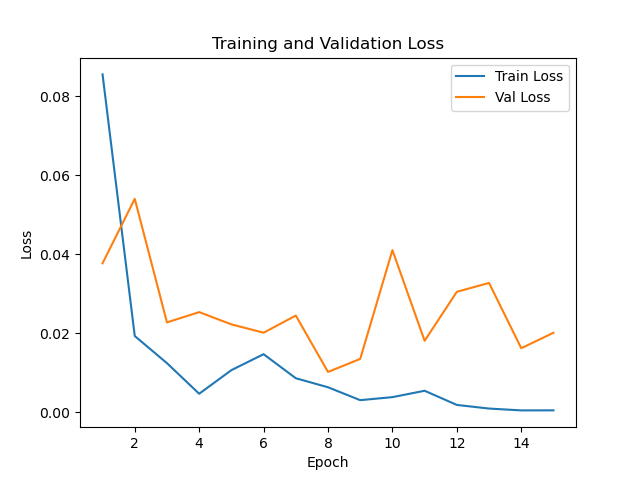
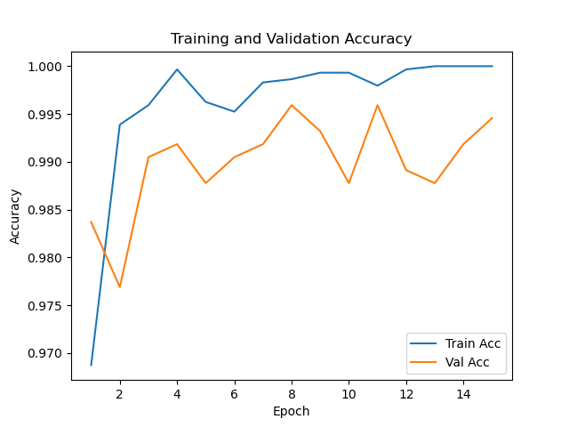
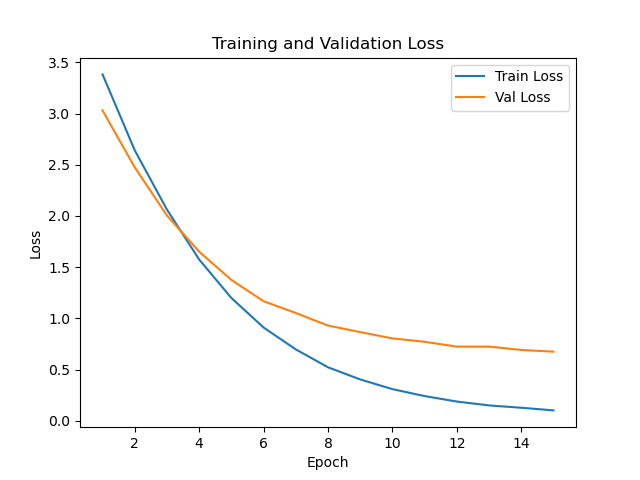
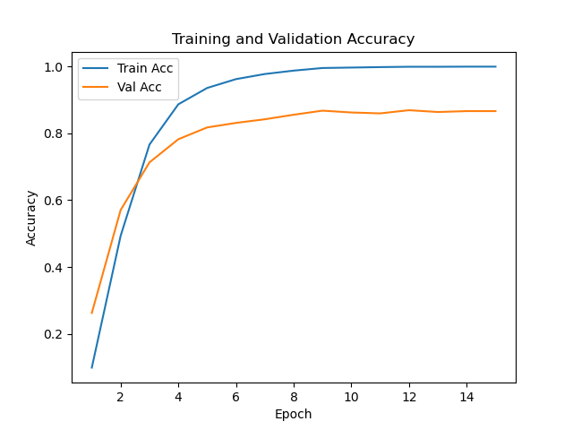
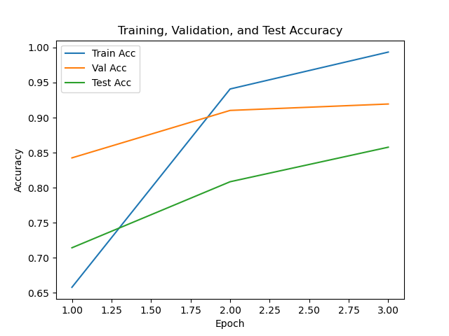
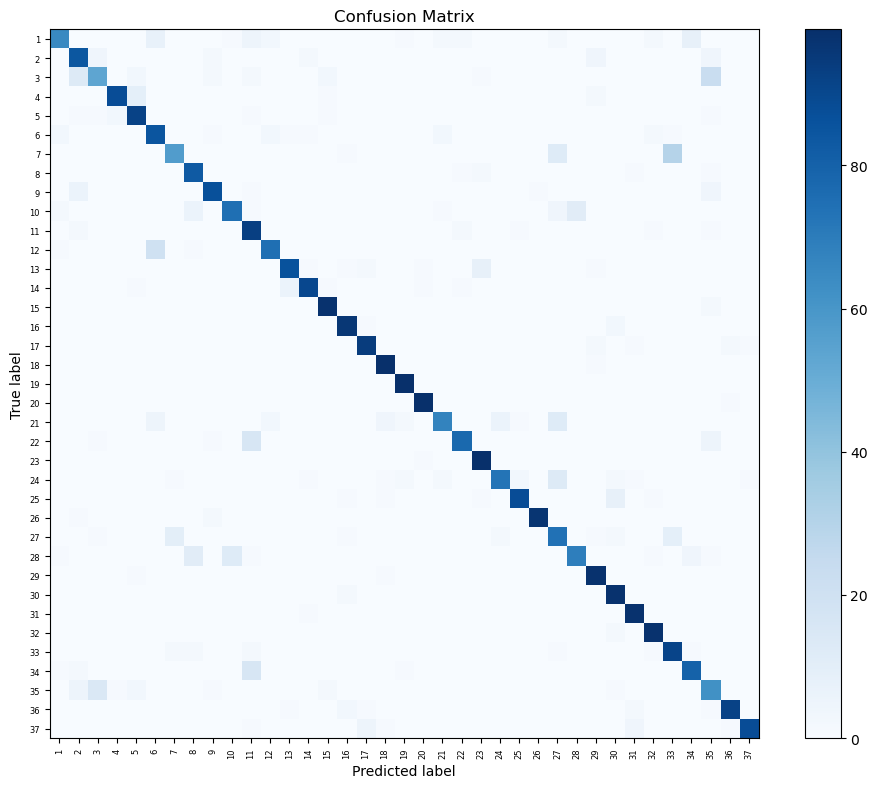
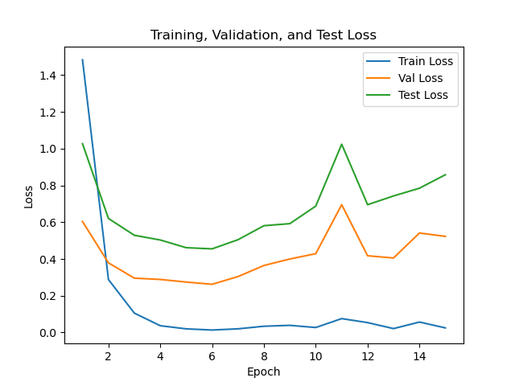
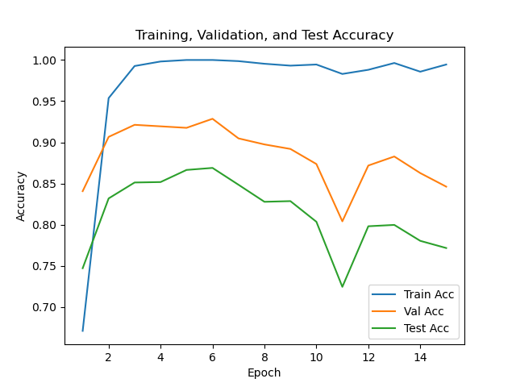
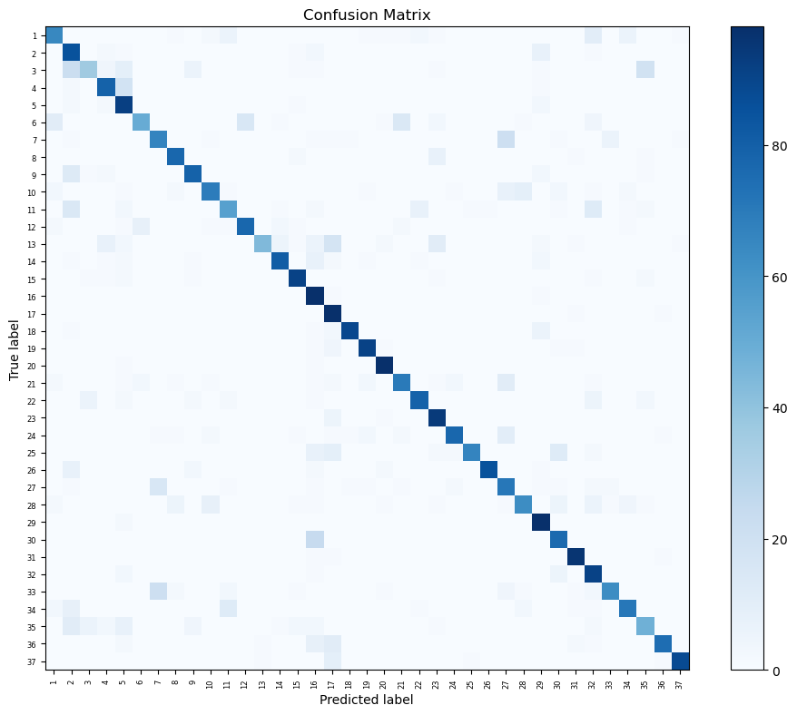

## Stage 1 Binary Classification Run (2025-05-14_00-09-01)

**Log:**

[Telemetry] Number of training samples: 2944
[Telemetry] Number of validation samples: 736
[Telemetry] Number of test samples: 3669
[Telemetry] Batch size: 32
[Telemetry] Using device: mps

[Telemetry] Starting epoch 1/15
[Telemetry][Epoch 1] Batch 92/92 | Loss: 0.0759 | Acc: 0.9688
[Telemetry] Epoch 1 | Train Loss: 0.0855 | Train Acc: 0.9688
[Telemetry] Epoch 1 | Val Loss: 0.0377 | Val Acc: 0.9837

[Telemetry] Starting epoch 2/15
[Telemetry][Epoch 2] Batch 92/92 | Loss: 0.0046 | Acc: 1.0000
[Telemetry] Epoch 2 | Train Loss: 0.0193 | Train Acc: 0.9939
[Telemetry] Epoch 2 | Val Loss: 0.0540 | Val Acc: 0.9769

[Telemetry] Starting epoch 3/15
[Telemetry][Epoch 3] Batch 92/92 | Loss: 0.0034 | Acc: 1.0000
[Telemetry] Epoch 3 | Train Loss: 0.0124 | Train Acc: 0.9959
[Telemetry] Epoch 3 | Val Loss: 0.0227 | Val Acc: 0.9905

[Telemetry] Starting epoch 4/15
[Telemetry][Epoch 4] Batch 92/92 | Loss: 0.0009 | Acc: 1.0000
[Telemetry] Epoch 4 | Train Loss: 0.0046 | Train Acc: 0.9997
[Telemetry] Epoch 4 | Val Loss: 0.0253 | Val Acc: 0.9918

[Telemetry] Starting epoch 5/15
[Telemetry][Epoch 5] Batch 92/92 | Loss: 0.0119 | Acc: 1.0000
[Telemetry] Epoch 5 | Train Loss: 0.0106 | Train Acc: 0.9963
[Telemetry] Epoch 5 | Val Loss: 0.0222 | Val Acc: 0.9878

[Telemetry] Starting epoch 6/15
[Telemetry][Epoch 6] Batch 92/92 | Loss: 0.0009 | Acc: 1.0000
[Telemetry] Epoch 6 | Train Loss: 0.0147 | Train Acc: 0.9952
[Telemetry] Epoch 6 | Val Loss: 0.0201 | Val Acc: 0.9905

[Telemetry] Starting epoch 7/15
[Telemetry][Epoch 7] Batch 92/92 | Loss: 0.0003 | Acc: 1.0000
[Telemetry] Epoch 7 | Train Loss: 0.0086 | Train Acc: 0.9983
[Telemetry] Epoch 7 | Val Loss: 0.0244 | Val Acc: 0.9918

[Telemetry] Starting epoch 8/15
[Telemetry][Epoch 8] Batch 92/92 | Loss: 0.0003 | Acc: 1.0000
[Telemetry] Epoch 8 | Train Loss: 0.0063 | Train Acc: 0.9986
[Telemetry] Epoch 8 | Val Loss: 0.0102 | Val Acc: 0.9959

[Telemetry] Starting epoch 9/15
[Telemetry][Epoch 9] Batch 92/92 | Loss: 0.0011 | Acc: 1.0000
[Telemetry] Epoch 9 | Train Loss: 0.0030 | Train Acc: 0.9993
[Telemetry] Epoch 9 | Val Loss: 0.0135 | Val Acc: 0.9932

[Telemetry] Starting epoch 10/15
[Telemetry][Epoch 10] Batch 92/92 | Loss: 0.0013 | Acc: 1.0000
[Telemetry] Epoch 10 | Train Loss: 0.0038 | Train Acc: 0.9993
[Telemetry] Epoch 10 | Val Loss: 0.0410 | Val Acc: 0.9878

[Telemetry] Starting epoch 11/15
[Telemetry][Epoch 11] Batch 92/92 | Loss: 0.0016 | Acc: 1.0000
[Telemetry] Epoch 11 | Train Loss: 0.0054 | Train Acc: 0.9980
[Telemetry] Epoch 11 | Val Loss: 0.0180 | Val Acc: 0.9959

[Telemetry] Starting epoch 12/15
[Telemetry][Epoch 12] Batch 92/92 | Loss: 0.0002 | Acc: 1.0000
[Telemetry] Epoch 12 | Train Loss: 0.0018 | Train Acc: 0.9997
[Telemetry] Epoch 12 | Val Loss: 0.0304 | Val Acc: 0.9891

[Telemetry] Starting epoch 13/15
[Telemetry][Epoch 13] Batch 92/92 | Loss: 0.0002 | Acc: 1.0000
[Telemetry] Epoch 13 | Train Loss: 0.0009 | Train Acc: 1.0000
[Telemetry] Epoch 13 | Val Loss: 0.0327 | Val Acc: 0.9878

[Telemetry] Starting epoch 14/15
[Telemetry][Epoch 14] Batch 92/92 | Loss: 0.0004 | Acc: 1.0000
[Telemetry] Epoch 14 | Train Loss: 0.0004 | Train Acc: 1.0000
[Telemetry] Epoch 14 | Val Loss: 0.0162 | Val Acc: 0.9918

[Telemetry] Starting epoch 15/15
[Telemetry][Epoch 15] Batch 92/92 | Loss: 0.0001 | Acc: 1.0000
[Telemetry] Epoch 15 | Train Loss: 0.0004 | Train Acc: 1.0000
[Telemetry] Epoch 15 | Val Loss: 0.0201 | Val Acc: 0.9946
[Telemetry] Test Loss: 0.0368 | Test Acc: 0.9891

## Stage 2 Multi-class Classification Run (2025-05-14_01-32-49)

**Log:**

[Telemetry] Number of training samples: 2944
[Telemetry] Number of validation samples: 736
[Telemetry] Batch size: 32
[Telemetry] Using device: mps
[Telemetry] Strategy: simultaneous
[Telemetry] Fine-tuning last 2 layers + classifier from start.

[Telemetry] Starting epoch 1/15
[Telemetry][Epoch 1] Batch 92/92 | Loss: 3.0837 | Acc: 0.2188
[Telemetry] Epoch 1 | Train Loss: 3.3820 | Train Acc: 0.0985
[Telemetry] Epoch 1 | Val Loss: 3.0307 | Val Acc: 0.2622

[Telemetry] Starting epoch 2/15
[Telemetry][Epoch 2] Batch 92/92 | Loss: 2.3433 | Acc: 0.5312
[Telemetry] Epoch 2 | Train Loss: 2.6407 | Train Acc: 0.4935
[Telemetry] Epoch 2 | Val Loss: 2.4749 | Val Acc: 0.5707

[Telemetry] Starting epoch 3/15
[Telemetry][Epoch 3] Batch 92/92 | Loss: 2.0067 | Acc: 0.6250
[Telemetry] Epoch 3 | Train Loss: 2.0615 | Train Acc: 0.7666
[Telemetry] Epoch 3 | Val Loss: 2.0044 | Val Acc: 0.7133

[Telemetry] Starting epoch 4/15
[Telemetry][Epoch 4] Batch 92/92 | Loss: 1.5887 | Acc: 0.8750
[Telemetry] Epoch 4 | Train Loss: 1.5746 | Train Acc: 0.8872
[Telemetry] Epoch 4 | Val Loss: 1.6510 | Val Acc: 0.7826

[Telemetry] Starting epoch 5/15
[Telemetry][Epoch 5] Batch 92/92 | Loss: 1.1931 | Acc: 1.0000
[Telemetry] Epoch 5 | Train Loss: 1.1988 | Train Acc: 0.9361
[Telemetry] Epoch 5 | Val Loss: 1.3756 | Val Acc: 0.8179

[Telemetry] Starting epoch 6/15
[Telemetry][Epoch 6] Batch 92/92 | Loss: 0.8709 | Acc: 1.0000
[Telemetry] Epoch 6 | Train Loss: 0.9104 | Train Acc: 0.9626
[Telemetry] Epoch 6 | Val Loss: 1.1674 | Val Acc: 0.8315

[Telemetry] Starting epoch 7/15
[Telemetry][Epoch 7] Batch 92/92 | Loss: 0.6715 | Acc: 1.0000
[Telemetry] Epoch 7 | Train Loss: 0.6970 | Train Acc: 0.9779
[Telemetry] Epoch 7 | Val Loss: 1.0525 | Val Acc: 0.8424

[Telemetry] Starting epoch 8/15
[Telemetry][Epoch 8] Batch 92/92 | Loss: 0.5893 | Acc: 1.0000
[Telemetry] Epoch 8 | Train Loss: 0.5222 | Train Acc: 0.9881
[Telemetry] Epoch 8 | Val Loss: 0.9296 | Val Acc: 0.8560

[Telemetry] Starting epoch 9/15
[Telemetry][Epoch 9] Batch 92/92 | Loss: 0.4465 | Acc: 1.0000
[Telemetry] Epoch 9 | Train Loss: 0.4033 | Train Acc: 0.9959
[Telemetry] Epoch 9 | Val Loss: 0.8659 | Val Acc: 0.8682

[Telemetry] Starting epoch 10/15
[Telemetry][Epoch 10] Batch 92/92 | Loss: 0.3793 | Acc: 0.9688
[Telemetry] Epoch 10 | Train Loss: 0.3089 | Train Acc: 0.9973
[Telemetry] Epoch 10 | Val Loss: 0.8041 | Val Acc: 0.8628

[Telemetry] Starting epoch 11/15
[Telemetry][Epoch 11] Batch 92/92 | Loss: 0.1977 | Acc: 1.0000
[Telemetry] Epoch 11 | Train Loss: 0.2411 | Train Acc: 0.9986
[Telemetry] Epoch 11 | Val Loss: 0.7714 | Val Acc: 0.8601

[Telemetry] Starting epoch 12/15
[Telemetry][Epoch 12] Batch 92/92 | Loss: 0.1600 | Acc: 1.0000
[Telemetry] Epoch 12 | Train Loss: 0.1876 | Train Acc: 0.9997
[Telemetry] Epoch 12 | Val Loss: 0.7240 | Val Acc: 0.8696

[Telemetry] Starting epoch 13/15
[Telemetry][Epoch 13] Batch 92/92 | Loss: 0.1309 | Acc: 1.0000
[Telemetry] Epoch 13 | Train Loss: 0.1498 | Train Acc: 0.9997
[Telemetry] Epoch 13 | Val Loss: 0.7239 | Val Acc: 0.8641

[Telemetry] Starting epoch 14/15
[Telemetry][Epoch 14] Batch 92/92 | Loss: 0.1455 | Acc: 1.0000
[Telemetry] Epoch 14 | Train Loss: 0.1272 | Train Acc: 1.0000
[Telemetry] Epoch 14 | Val Loss: 0.6914 | Val Acc: 0.8668

[Telemetry] Starting epoch 15/15
[Telemetry][Epoch 15] Batch 92/92 | Loss: 0.0839 | Acc: 1.0000
[Telemetry] Epoch 15 | Train Loss: 0.1012 | Train Acc: 1.0000
[Telemetry] Epoch 15 | Val Loss: 0.6748 | Val Acc: 0.8668

## Stage 3 Imbalanced Classification Run (2025-05-14_12-50-08)

**Model saved at:** `models/stage3-imbalance-2025-05-14_12-50-08.pt`

**Log:**

[Telemetry] Training class distribution (label: count): [(0, 14), (1, 84), (2, 81), (3, 73), (4, 79), (5, 15), (6, 14), (7, 16), (8, 82), (9, 19), (10, 77), (11, 16), (12, 81), (13, 77), (14, 73), (15, 75), (16, 80), (17, 79), (18, 83), (19, 84), (20, 16), (21, 87), (22, 75), (23, 13), (24, 81), (25, 76), (26, 19), (27, 17), (28, 82), (29, 84), (30, 76), (31, 84), (32, 16), (33, 14), (34, 79), (35, 77), (36, 84)]
[Telemetry] Number of training samples: 2182
[Telemetry] Number of test samples: 3669
[Telemetry] Batch size: 32
[Telemetry] Using device: mps
[Telemetry] Cat keep fraction: 0.2

[Telemetry] Starting epoch 1/3
[Telemetry][Epoch 1] Batch 69/69 | Loss: 0.7559 | Acc: 0.8333
[Telemetry] Epoch 1 | Train Loss: 1.5291 | Train Acc: 0.6577
[Telemetry] Epoch 1 | Val Loss: 0.6101 | Val Acc: 0.8425
[Telemetry] Epoch 1 | Test Loss: 1.0753 | Test Acc: 0.7141

[Telemetry] Starting epoch 2/3
[Telemetry][Epoch 2] Batch 69/69 | Loss: 0.3354 | Acc: 0.8333
[Telemetry] Epoch 2 | Train Loss: 0.3140 | Train Acc: 0.9409
[Telemetry] Epoch 2 | Val Loss: 0.3907 | Val Acc: 0.9103
[Telemetry] Epoch 2 | Test Loss: 0.6471 | Test Acc: 0.8084

[Telemetry] Starting epoch 3/3
[Telemetry][Epoch 3] Batch 69/69 | Loss: 0.0980 | Acc: 1.0000
[Telemetry] Epoch 3 | Train Loss: 0.0988 | Train Acc: 0.9936
[Telemetry] Epoch 3 | Val Loss: 0.3172 | Val Acc: 0.9194
[Telemetry] Epoch 3 | Test Loss: 0.5065 | Test Acc: 0.8577
[Telemetry] Per-class accuracy:
  Class  1: 0.6633 (65/98)
  Class  2: 0.8400 (84/100)
  Class  3: 0.5300 (53/100)
  Class  4: 0.8800 (88/100)
  Class  5: 0.9200 (92/100)
  Class  6: 0.8500 (85/100)
  Class  7: 0.5700 (57/100)
  Class  8: 0.9432 (83/88)
  Class  9: 0.8788 (87/99)
  Class 10: 0.7500 (75/100)
  Class 11: 0.9300 (93/100)
  Class 12: 0.7732 (75/97)
  Class 13: 0.8600 (86/100)
  Class 14: 0.9000 (90/100)
  Class 15: 0.9800 (98/100)
  Class 16: 0.9600 (96/100)
  Class 17: 0.9400 (94/100)
  Class 18: 0.9900 (99/100)
  Class 19: 1.0000 (99/99)
  Class 20: 0.9900 (99/100)
  Class 21: 0.6700 (67/100)
  Class 22: 0.7700 (77/100)
  Class 23: 0.9900 (99/100)
  Class 24: 0.7300 (73/100)
  Class 25: 0.8800 (88/100)
  Class 26: 0.9700 (97/100)
  Class 27: 0.7400 (74/100)
  Class 28: 0.6900 (69/100)
  Class 29: 0.9800 (98/100)
  Class 30: 0.9800 (98/100)
  Class 31: 0.9899 (98/99)
  Class 32: 0.9800 (98/100)
  Class 33: 0.9100 (91/100)
  Class 34: 0.8000 (80/100)
  Class 35: 0.6966 (62/89)
  Class 36: 0.9200 (92/100)
  Class 37: 0.8800 (88/100)
[Telemetry] Confusion matrix saved to: logs/plots/stage3-imbalance-2025-05-14_12-50-08-confmat.png
[Telemetry] Model saved to: models/stage3-imbalance-2025-05-14_12-50-08.pt

## Stage 3 Imbalanced Classification Run (2025-05-14_12-58-25)

**Model saved at:** `models/stage3-imbalance-2025-05-14_12-58-25.pt`

**Log:**

[Telemetry] Training class distribution (label: count): [(0, 14), (1, 84), (2, 81), (3, 73), (4, 79), (5, 15), (6, 14), (7, 16), (8, 82), (9, 19), (10, 77), (11, 16), (12, 81), (13, 77), (14, 73), (15, 75), (16, 80), (17, 79), (18, 83), (19, 84), (20, 16), (21, 87), (22, 75), (23, 13), (24, 81), (25, 76), (26, 19), (27, 17), (28, 82), (29, 84), (30, 76), (31, 84), (32, 16), (33, 14), (34, 79), (35, 77), (36, 84)]
[Telemetry] Number of training samples: 2182
[Telemetry] Number of test samples: 3669
[Telemetry] Batch size: 32
[Telemetry] Using device: mps
[Telemetry] Cat keep fraction: 0.2

[Telemetry] Starting epoch 1/15
[Telemetry][Epoch 1] Batch 69/69 | Loss: 0.7677 | Acc: 0.8333
[Telemetry] Epoch 1 | Train Loss: 1.4831 | Train Acc: 0.6709
[Telemetry] Epoch 1 | Val Loss: 0.6037 | Val Acc: 0.8407
[Telemetry] Epoch 1 | Test Loss: 1.0268 | Test Acc: 0.7471

[Telemetry] Starting epoch 2/15
[Telemetry][Epoch 2] Batch 69/69 | Loss: 1.0095 | Acc: 0.6667
[Telemetry] Epoch 2 | Train Loss: 0.2882 | Train Acc: 0.9537
[Telemetry] Epoch 2 | Val Loss: 0.3790 | Val Acc: 0.9066
[Telemetry] Epoch 2 | Test Loss: 0.6204 | Test Acc: 0.8318

[Telemetry] Starting epoch 3/15
[Telemetry][Epoch 3] Batch 69/69 | Loss: 0.2176 | Acc: 1.0000
[Telemetry] Epoch 3 | Train Loss: 0.1055 | Train Acc: 0.9927
[Telemetry] Epoch 3 | Val Loss: 0.2957 | Val Acc: 0.9212
[Telemetry] Epoch 3 | Test Loss: 0.5289 | Test Acc: 0.8512

[Telemetry] Starting epoch 4/15
[Telemetry][Epoch 4] Batch 69/69 | Loss: 0.0803 | Acc: 1.0000
[Telemetry] Epoch 4 | Train Loss: 0.0370 | Train Acc: 0.9982
[Telemetry] Epoch 4 | Val Loss: 0.2887 | Val Acc: 0.9194
[Telemetry] Epoch 4 | Test Loss: 0.5032 | Test Acc: 0.8517

[Telemetry] Starting epoch 5/15
[Telemetry][Epoch 5] Batch 69/69 | Loss: 0.0555 | Acc: 1.0000
[Telemetry] Epoch 5 | Train Loss: 0.0200 | Train Acc: 1.0000
[Telemetry] Epoch 5 | Val Loss: 0.2745 | Val Acc: 0.9176
[Telemetry] Epoch 5 | Test Loss: 0.4614 | Test Acc: 0.8664

[Telemetry] Starting epoch 6/15
[Telemetry][Epoch 6] Batch 69/69 | Loss: 0.2880 | Acc: 1.0000
[Telemetry] Epoch 6 | Train Loss: 0.0136 | Train Acc: 1.0000
[Telemetry] Epoch 6 | Val Loss: 0.2624 | Val Acc: 0.9286
[Telemetry] Epoch 6 | Test Loss: 0.4550 | Test Acc: 0.8689

[Telemetry] Starting epoch 7/15
[Telemetry][Epoch 7] Batch 69/69 | Loss: 0.3275 | Acc: 1.0000
[Telemetry] Epoch 7 | Train Loss: 0.0201 | Train Acc: 0.9986
[Telemetry] Epoch 7 | Val Loss: 0.3043 | Val Acc: 0.9048
[Telemetry] Epoch 7 | Test Loss: 0.5048 | Test Acc: 0.8485

[Telemetry] Starting epoch 8/15
[Telemetry][Epoch 8] Batch 69/69 | Loss: 0.1347 | Acc: 1.0000
[Telemetry] Epoch 8 | Train Loss: 0.0342 | Train Acc: 0.9954
[Telemetry] Epoch 8 | Val Loss: 0.3647 | Val Acc: 0.8974
[Telemetry] Epoch 8 | Test Loss: 0.5811 | Test Acc: 0.8277

[Telemetry] Starting epoch 9/15
[Telemetry][Epoch 9] Batch 69/69 | Loss: 0.0543 | Acc: 1.0000
[Telemetry] Epoch 9 | Train Loss: 0.0390 | Train Acc: 0.9931
[Telemetry] Epoch 9 | Val Loss: 0.3999 | Val Acc: 0.8919
[Telemetry] Epoch 9 | Test Loss: 0.5921 | Test Acc: 0.8286

[Telemetry] Starting epoch 10/15
[Telemetry][Epoch 10] Batch 69/69 | Loss: 0.5900 | Acc: 0.8333
[Telemetry] Epoch 10 | Train Loss: 0.0272 | Train Acc: 0.9945
[Telemetry] Epoch 10 | Val Loss: 0.4289 | Val Acc: 0.8736
[Telemetry] Epoch 10 | Test Loss: 0.6877 | Test Acc: 0.8035

[Telemetry] Starting epoch 11/15
[Telemetry][Epoch 11] Batch 69/69 | Loss: 0.0351 | Acc: 1.0000
[Telemetry] Epoch 11 | Train Loss: 0.0757 | Train Acc: 0.9830
[Telemetry] Epoch 11 | Val Loss: 0.6952 | Val Acc: 0.8040
[Telemetry] Epoch 11 | Test Loss: 1.0240 | Test Acc: 0.7244

[Telemetry] Starting epoch 12/15
[Telemetry][Epoch 12] Batch 69/69 | Loss: 0.0384 | Acc: 1.0000
[Telemetry] Epoch 12 | Train Loss: 0.0539 | Train Acc: 0.9881
[Telemetry] Epoch 12 | Val Loss: 0.4175 | Val Acc: 0.8718
[Telemetry] Epoch 12 | Test Loss: 0.6952 | Test Acc: 0.7980

[Telemetry] Starting epoch 13/15
[Telemetry][Epoch 13] Batch 69/69 | Loss: 0.0880 | Acc: 1.0000
[Telemetry] Epoch 13 | Train Loss: 0.0214 | Train Acc: 0.9963
[Telemetry] Epoch 13 | Val Loss: 0.4054 | Val Acc: 0.8828
[Telemetry] Epoch 13 | Test Loss: 0.7427 | Test Acc: 0.7997

[Telemetry] Starting epoch 14/15
[Telemetry][Epoch 14] Batch 69/69 | Loss: 0.0805 | Acc: 1.0000
[Telemetry] Epoch 14 | Train Loss: 0.0571 | Train Acc: 0.9858
[Telemetry] Epoch 14 | Val Loss: 0.5412 | Val Acc: 0.8626
[Telemetry] Epoch 14 | Test Loss: 0.7849 | Test Acc: 0.7803

[Telemetry] Starting epoch 15/15
[Telemetry][Epoch 15] Batch 69/69 | Loss: 0.1248 | Acc: 1.0000
[Telemetry] Epoch 15 | Train Loss: 0.0252 | Train Acc: 0.9945
[Telemetry] Epoch 15 | Val Loss: 0.5230 | Val Acc: 0.8462
[Telemetry] Epoch 15 | Test Loss: 0.8581 | Test Acc: 0.7716
[Telemetry] Per-class accuracy:
  Class  1: 0.6633 (65/98)
  Class  2: 0.8500 (85/100)
  Class  3: 0.3600 (36/100)
  Class  4: 0.7900 (79/100)
  Class  5: 0.9200 (92/100)
  Class  6: 0.5000 (50/100)
  Class  7: 0.6600 (66/100)
  Class  8: 0.8750 (77/88)
  Class  9: 0.7980 (79/99)
  Class 10: 0.6900 (69/100)
  Class 11: 0.5500 (55/100)
  Class 12: 0.7938 (77/97)
  Class 13: 0.4400 (44/100)
  Class 14: 0.8100 (81/100)
  Class 15: 0.9100 (91/100)
  Class 16: 0.9800 (98/100)
  Class 17: 0.9800 (98/100)
  Class 18: 0.8900 (89/100)
  Class 19: 0.9192 (91/99)
  Class 20: 0.9800 (98/100)
  Class 21: 0.7000 (70/100)
  Class 22: 0.7900 (79/100)
  Class 23: 0.9400 (94/100)
  Class 24: 0.7700 (77/100)
  Class 25: 0.6600 (66/100)
  Class 26: 0.8500 (85/100)
  Class 27: 0.7100 (71/100)
  Class 28: 0.6300 (63/100)
  Class 29: 0.9800 (98/100)
  Class 30: 0.7600 (76/100)
  Class 31: 0.9697 (96/99)
  Class 32: 0.9100 (91/100)
  Class 33: 0.6300 (63/100)
  Class 34: 0.7100 (71/100)
  Class 35: 0.5393 (48/89)
  Class 36: 0.7500 (75/100)
  Class 37: 0.8800 (88/100)
[Telemetry] Confusion matrix saved to: logs/plots/stage3-imbalance-2025-05-14_12-58-25-confmat.png
[Telemetry] Model saved to: models/stage3-imbalance-2025-05-14_12-58-25.pt
