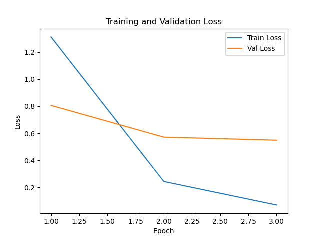

## Stage 1 Binary Classification Run (2025-05-13_17-10-16)

**Log:**

[Telemetry] Number of training samples: 3680
[Telemetry] Number of validation samples: 3680
[Telemetry] Number of test samples: 3669
[Telemetry] Batch size: 32
[Telemetry] Using device: mps

[Telemetry] Starting epoch 1/3
[Telemetry][Epoch 1] Batch 100/115 | Loss: 0.0193 | Acc: 1.0000
[Telemetry][Epoch 1] Batch 115/115 | Loss: 0.1727 | Acc: 0.9375
[Telemetry] Epoch 1 | Train Loss: 0.0724 | Train Acc: 0.9764
[Telemetry] Epoch 1 | Val Loss: 0.0170 | Val Acc: 0.9932

[Telemetry] Starting epoch 2/3
[Telemetry][Epoch 2] Batch 100/115 | Loss: 0.0030 | Acc: 1.0000
[Telemetry][Epoch 2] Batch 115/115 | Loss: 0.0032 | Acc: 1.0000
[Telemetry] Epoch 2 | Train Loss: 0.0184 | Train Acc: 0.9948
[Telemetry] Epoch 2 | Val Loss: 0.0031 | Val Acc: 0.9995

[Telemetry] Starting epoch 3/3
[Telemetry][Epoch 3] Batch 100/115 | Loss: 0.0005 | Acc: 1.0000
[Telemetry][Epoch 3] Batch 115/115 | Loss: 0.1148 | Acc: 0.9688
[Telemetry] Epoch 3 | Train Loss: 0.0067 | Train Acc: 0.9981
[Telemetry] Epoch 3 | Val Loss: 0.0013 | Val Acc: 0.9997
[Telemetry] Test Loss: 0.0290 | Test Acc: 0.9886

## Stage 2 Multi-class Classification Run (2025-05-13_17-17-24)

**Log:**

[Telemetry] Number of training samples: 3680
[Telemetry] Number of validation samples: 3680
[Telemetry] Batch size: 32
[Telemetry] Using device: mps
[Telemetry] Strategy: simultaneous
[Telemetry] Fine-tuning last 2 layers + classifier from start.

[Telemetry] Starting epoch 1/3
[Telemetry][Epoch 1] Batch 100/115 | Loss: 2.9586 | Acc: 0.3750
[Telemetry][Epoch 1] Batch 115/115 | Loss: 2.8659 | Acc: 0.3438
[Telemetry] Epoch 1 | Train Loss: 3.2559 | Train Acc: 0.1791
[Telemetry] Epoch 1 | Val Loss: 2.6674 | Val Acc: 0.5043

[Telemetry] Starting epoch 2/3
[Telemetry][Epoch 2] Batch 100/115 | Loss: 2.2891 | Acc: 0.6562
[Telemetry][Epoch 2] Batch 115/115 | Loss: 2.2166 | Acc: 0.7188
[Telemetry] Epoch 2 | Train Loss: 2.4206 | Train Acc: 0.6038
[Telemetry] Epoch 2 | Val Loss: 1.9221 | Val Acc: 0.7921

[Telemetry] Starting epoch 3/3
[Telemetry][Epoch 3] Batch 100/115 | Loss: 1.8099 | Acc: 0.8438
[Telemetry][Epoch 3] Batch 115/115 | Loss: 1.6151 | Acc: 0.8125
[Telemetry] Epoch 3 | Train Loss: 1.7778 | Train Acc: 0.8035
[Telemetry] Epoch 3 | Val Loss: 1.3473 | Val Acc: 0.9035

## Stage 3 Imbalanced Classification Run (2025-05-13_17-19-52)

**Log:**

[Telemetry] Training class distribution (label: count): [(0, 20), (1, 100), (2, 100), (3, 100), (4, 100), (5, 20), (6, 20), (7, 19), (8, 100), (9, 20), (10, 100), (11, 18), (12, 96), (13, 100), (14, 100), (15, 100), (16, 100), (17, 100), (18, 100), (19, 100), (20, 20), (21, 100), (22, 96), (23, 20), (24, 100), (25, 100), (26, 20), (27, 20), (28, 100), (29, 100), (30, 100), (31, 100), (32, 19), (33, 20), (34, 100), (35, 100), (36, 100)]
[Telemetry] Number of training samples: 2728
[Telemetry] Number of test samples: 3669
[Telemetry] Batch size: 32
[Telemetry] Using device: mps
[Telemetry] Cat keep fraction: 0.2

[Telemetry] Starting epoch 1/3
[Telemetry][Epoch 1] Batch 86/86 | Loss: 1.0671 | Acc: 0.7500
[Telemetry] Epoch 1 | Train Loss: 1.3116 | Train Acc: 0.7031
[Telemetry] Epoch 1 | Val Loss: 0.8064 | Val Acc: 0.8029

[Telemetry] Starting epoch 2/3
[Telemetry][Epoch 2] Batch 86/86 | Loss: 0.3344 | Acc: 1.0000
[Telemetry] Epoch 2 | Train Loss: 0.2444 | Train Acc: 0.9615
[Telemetry] Epoch 2 | Val Loss: 0.5719 | Val Acc: 0.8256

[Telemetry] Starting epoch 3/3
[Telemetry][Epoch 3] Batch 86/86 | Loss: 0.1611 | Acc: 1.0000
[Telemetry] Epoch 3 | Train Loss: 0.0708 | Train Acc: 0.9938
[Telemetry] Epoch 3 | Val Loss: 0.5492 | Val Acc: 0.8348
[Telemetry] Per-class accuracy:
  Class  1: 0.7755 (76/98)
  Class  2: 0.8700 (87/100)
  Class  3: 0.5800 (58/100)
  Class  4: 0.9100 (91/100)
  Class  5: 0.8900 (89/100)
  Class  6: 0.5300 (53/100)
  Class  7: 0.3500 (35/100)
  Class  8: 0.8864 (78/88)
  Class  9: 0.9091 (90/99)
  Class 10: 0.4800 (48/100)
  Class 11: 0.9000 (90/100)
  Class 12: 0.8454 (82/97)
  Class 13: 0.9000 (90/100)
  Class 14: 0.9500 (95/100)
  Class 15: 1.0000 (100/100)
  Class 16: 0.9400 (94/100)
  Class 17: 0.9500 (95/100)
  Class 18: 0.9900 (99/100)
  Class 19: 0.9899 (98/99)
  Class 20: 0.9900 (99/100)
  Class 21: 0.9400 (94/100)
  Class 22: 0.9000 (90/100)
  Class 23: 0.9700 (97/100)
  Class 24: 0.5000 (50/100)
  Class 25: 0.9800 (98/100)
  Class 26: 0.9000 (90/100)
  Class 27: 0.1200 (12/100)
  Class 28: 0.8400 (84/100)
  Class 29: 0.9800 (98/100)
  Class 30: 0.9700 (97/100)
  Class 31: 0.9899 (98/99)
  Class 32: 0.9600 (96/100)
  Class 33: 0.7800 (78/100)
  Class 34: 0.8900 (89/100)
  Class 35: 0.6292 (56/89)
  Class 36: 0.9400 (94/100)
  Class 37: 0.9500 (95/100)
