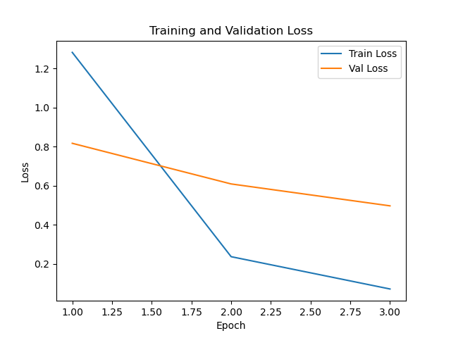

## Stage 1 Binary Classification Run (2025-05-13_17-10-16)

**Log:**

[Telemetry] Number of training samples: 3680
[Telemetry] Number of validation samples: 3680
[Telemetry] Number of test samples: 3669
[Telemetry] Batch size: 32
[Telemetry] Using device: mps

[Telemetry] Starting epoch 1/3
[Telemetry][Epoch 1] Batch 100/115 | Loss: 0.0193 | Acc: 1.0000
[Telemetry][Epoch 1] Batch 115/115 | Loss: 0.1727 | Acc: 0.9375
[Telemetry] Epoch 1 | Train Loss: 0.0724 | Train Acc: 0.9764
[Telemetry] Epoch 1 | Val Loss: 0.0170 | Val Acc: 0.9932

[Telemetry] Starting epoch 2/3
[Telemetry][Epoch 2] Batch 100/115 | Loss: 0.0030 | Acc: 1.0000
[Telemetry][Epoch 2] Batch 115/115 | Loss: 0.0032 | Acc: 1.0000
[Telemetry] Epoch 2 | Train Loss: 0.0184 | Train Acc: 0.9948
[Telemetry] Epoch 2 | Val Loss: 0.0031 | Val Acc: 0.9995

[Telemetry] Starting epoch 3/3
[Telemetry][Epoch 3] Batch 100/115 | Loss: 0.0005 | Acc: 1.0000
[Telemetry][Epoch 3] Batch 115/115 | Loss: 0.1148 | Acc: 0.9688
[Telemetry] Epoch 3 | Train Loss: 0.0067 | Train Acc: 0.9981
[Telemetry] Epoch 3 | Val Loss: 0.0013 | Val Acc: 0.9997
[Telemetry] Test Loss: 0.0290 | Test Acc: 0.9886

## Stage 2 Multi-class Classification Run (2025-05-13_17-17-24)

**Log:**

[Telemetry] Number of training samples: 3680
[Telemetry] Number of validation samples: 3680
[Telemetry] Batch size: 32
[Telemetry] Using device: mps
[Telemetry] Strategy: simultaneous
[Telemetry] Fine-tuning last 2 layers + classifier from start.

[Telemetry] Starting epoch 1/3
[Telemetry][Epoch 1] Batch 100/115 | Loss: 2.9586 | Acc: 0.3750
[Telemetry][Epoch 1] Batch 115/115 | Loss: 2.8659 | Acc: 0.3438
[Telemetry] Epoch 1 | Train Loss: 3.2559 | Train Acc: 0.1791
[Telemetry] Epoch 1 | Val Loss: 2.6674 | Val Acc: 0.5043

[Telemetry] Starting epoch 2/3
[Telemetry][Epoch 2] Batch 100/115 | Loss: 2.2891 | Acc: 0.6562
[Telemetry][Epoch 2] Batch 115/115 | Loss: 2.2166 | Acc: 0.7188
[Telemetry] Epoch 2 | Train Loss: 2.4206 | Train Acc: 0.6038
[Telemetry] Epoch 2 | Val Loss: 1.9221 | Val Acc: 0.7921

[Telemetry] Starting epoch 3/3
[Telemetry][Epoch 3] Batch 100/115 | Loss: 1.8099 | Acc: 0.8438
[Telemetry][Epoch 3] Batch 115/115 | Loss: 1.6151 | Acc: 0.8125
[Telemetry] Epoch 3 | Train Loss: 1.7778 | Train Acc: 0.8035
[Telemetry] Epoch 3 | Val Loss: 1.3473 | Val Acc: 0.9035

## Stage 3 Imbalanced Classification Run (2025-05-13_17-29-25)

**Model saved at:** `models/stage3-imbalance-2025-05-13_17-29-25.pt`

**Log:**

[Telemetry] Training class distribution (label: count): [(0, 20), (1, 100), (2, 100), (3, 100), (4, 100), (5, 20), (6, 20), (7, 19), (8, 100), (9, 20), (10, 100), (11, 18), (12, 96), (13, 100), (14, 100), (15, 100), (16, 100), (17, 100), (18, 100), (19, 100), (20, 20), (21, 100), (22, 96), (23, 20), (24, 100), (25, 100), (26, 20), (27, 20), (28, 100), (29, 100), (30, 100), (31, 100), (32, 19), (33, 20), (34, 100), (35, 100), (36, 100)]
[Telemetry] Number of training samples: 2728
[Telemetry] Number of test samples: 3669
[Telemetry] Batch size: 32
[Telemetry] Using device: mps
[Telemetry] Cat keep fraction: 0.2

[Telemetry] Starting epoch 1/3
[Telemetry][Epoch 1] Batch 86/86 | Loss: 0.6777 | Acc: 0.8750
[Telemetry] Epoch 1 | Train Loss: 1.2829 | Train Acc: 0.7177
[Telemetry] Epoch 1 | Val Loss: 0.8173 | Val Acc: 0.7893

[Telemetry] Starting epoch 2/3
[Telemetry][Epoch 2] Batch 86/86 | Loss: 0.1441 | Acc: 1.0000
[Telemetry] Epoch 2 | Train Loss: 0.2365 | Train Acc: 0.9586
[Telemetry] Epoch 2 | Val Loss: 0.6091 | Val Acc: 0.8168

[Telemetry] Starting epoch 3/3
[Telemetry][Epoch 3] Batch 86/86 | Loss: 0.2389 | Acc: 1.0000
[Telemetry] Epoch 3 | Train Loss: 0.0711 | Train Acc: 0.9945
[Telemetry] Epoch 3 | Val Loss: 0.4969 | Val Acc: 0.8531
[Telemetry] Per-class accuracy:
  Class  1: 0.8776 (86/98)
  Class  2: 0.8800 (88/100)
  Class  3: 0.4500 (45/100)
  Class  4: 0.9400 (94/100)
  Class  5: 0.9000 (90/100)
  Class  6: 0.8100 (81/100)
  Class  7: 0.7800 (78/100)
  Class  8: 0.8864 (78/88)
  Class  9: 0.9091 (90/99)
  Class 10: 0.7600 (76/100)
  Class 11: 0.7700 (77/100)
  Class 12: 0.4433 (43/97)
  Class 13: 0.9700 (97/100)
  Class 14: 0.8800 (88/100)
  Class 15: 1.0000 (100/100)
  Class 16: 0.9600 (96/100)
  Class 17: 0.9500 (95/100)
  Class 18: 0.9900 (99/100)
  Class 19: 0.9798 (97/99)
  Class 20: 0.9600 (96/100)
  Class 21: 0.4100 (41/100)
  Class 22: 0.8700 (87/100)
  Class 23: 0.9400 (94/100)
  Class 24: 0.8900 (89/100)
  Class 25: 0.9200 (92/100)
  Class 26: 0.9700 (97/100)
  Class 27: 0.7000 (70/100)
  Class 28: 0.6900 (69/100)
  Class 29: 0.9600 (96/100)
  Class 30: 0.9900 (99/100)
  Class 31: 1.0000 (99/99)
  Class 32: 0.9700 (97/100)
  Class 33: 0.6700 (67/100)
  Class 34: 0.8600 (86/100)
  Class 35: 0.7191 (64/89)
  Class 36: 0.9200 (92/100)
  Class 37: 0.9700 (97/100)
[Telemetry] Confusion matrix saved to: logs/plots/stage3-imbalance-2025-05-13_17-29-25-confmat.png
[Telemetry] Model saved to: models/stage3-imbalance-2025-05-13_17-29-25.pt

## Stage 2 Multi-class Classification Run (2025-05-13_17-40-05)

**Log:**

[Telemetry] Number of training samples: 3680
[Telemetry] Number of validation samples: 3680
[Telemetry] Batch size: 32
[Telemetry] Using device: mps
[Telemetry] Strategy: simultaneous
[Telemetry] Fine-tuning last 2 layers + classifier from start.

[Telemetry] Starting epoch 1/3
[Telemetry][Epoch 1] Batch 100/115 | Loss: 3.0109 | Acc: 0.1875
[Telemetry][Epoch 1] Batch 115/115 | Loss: 2.9297 | Acc: 0.2500
[Telemetry] Epoch 1 | Train Loss: 3.3678 | Train Acc: 0.1293
[Telemetry] Epoch 1 | Val Loss: 2.7867 | Val Acc: 0.4209

[Telemetry] Starting epoch 2/3
[Telemetry][Epoch 2] Batch 100/115 | Loss: 2.1050 | Acc: 0.8125
[Telemetry][Epoch 2] Batch 115/115 | Loss: 2.2333 | Acc: 0.6875
[Telemetry] Epoch 2 | Train Loss: 2.5106 | Train Acc: 0.5481
[Telemetry] Epoch 2 | Val Loss: 2.0160 | Val Acc: 0.7704

[Telemetry] Starting epoch 3/3
[Telemetry][Epoch 3] Batch 100/115 | Loss: 1.7759 | Acc: 0.8438
[Telemetry][Epoch 3] Batch 115/115 | Loss: 1.5544 | Acc: 0.8750
[Telemetry] Epoch 3 | Train Loss: 1.8580 | Train Acc: 0.7878
[Telemetry] Epoch 3 | Val Loss: 1.4283 | Val Acc: 0.9071

## Stage 1 Binary Classification Run (2025-05-13_17-44-22)

**Log:**

[Telemetry] Number of training samples: 3680
[Telemetry] Number of validation samples: 3680
[Telemetry] Number of test samples: 3669
[Telemetry] Batch size: 32
[Telemetry] Using device: mps

[Telemetry] Starting epoch 1/15
[Telemetry][Epoch 1] Batch 100/115 | Loss: 0.0518 | Acc: 0.9688
[Telemetry][Epoch 1] Batch 115/115 | Loss: 0.0728 | Acc: 0.9688
[Telemetry] Epoch 1 | Train Loss: 0.0708 | Train Acc: 0.9766
[Telemetry] Epoch 1 | Val Loss: 0.0146 | Val Acc: 0.9976

[Telemetry] Starting epoch 2/15
[Telemetry][Epoch 2] Batch 100/115 | Loss: 0.0046 | Acc: 1.0000
[Telemetry][Epoch 2] Batch 115/115 | Loss: 0.0066 | Acc: 1.0000
[Telemetry] Epoch 2 | Train Loss: 0.0206 | Train Acc: 0.9943
[Telemetry] Epoch 2 | Val Loss: 0.0155 | Val Acc: 0.9948

[Telemetry] Starting epoch 3/15
[Telemetry][Epoch 3] Batch 100/115 | Loss: 0.0010 | Acc: 1.0000
[Telemetry][Epoch 3] Batch 115/115 | Loss: 0.0052 | Acc: 1.0000
[Telemetry] Epoch 3 | Train Loss: 0.0125 | Train Acc: 0.9962
[Telemetry] Epoch 3 | Val Loss: 0.0033 | Val Acc: 0.9995

[Telemetry] Starting epoch 4/15
[Telemetry][Epoch 4] Batch 100/115 | Loss: 0.0028 | Acc: 1.0000
[Telemetry][Epoch 4] Batch 115/115 | Loss: 0.0049 | Acc: 1.0000
[Telemetry] Epoch 4 | Train Loss: 0.0117 | Train Acc: 0.9970
[Telemetry] Epoch 4 | Val Loss: 0.0053 | Val Acc: 0.9997

[Telemetry] Starting epoch 5/15
[Telemetry][Epoch 5] Batch 100/115 | Loss: 0.1826 | Acc: 0.9688
[Telemetry][Epoch 5] Batch 115/115 | Loss: 0.0012 | Acc: 1.0000
[Telemetry] Epoch 5 | Train Loss: 0.0054 | Train Acc: 0.9989
[Telemetry] Epoch 5 | Val Loss: 0.0044 | Val Acc: 0.9989

[Telemetry] Starting epoch 6/15
[Telemetry][Epoch 6] Batch 100/115 | Loss: 0.0012 | Acc: 1.0000
[Telemetry][Epoch 6] Batch 115/115 | Loss: 0.0048 | Acc: 1.0000
[Telemetry] Epoch 6 | Train Loss: 0.0064 | Train Acc: 0.9986
[Telemetry] Epoch 6 | Val Loss: 0.0013 | Val Acc: 0.9997

[Telemetry] Starting epoch 7/15
[Telemetry][Epoch 7] Batch 100/115 | Loss: 0.0032 | Acc: 1.0000
[Telemetry][Epoch 7] Batch 115/115 | Loss: 0.0009 | Acc: 1.0000
[Telemetry] Epoch 7 | Train Loss: 0.0028 | Train Acc: 0.9995
[Telemetry] Epoch 7 | Val Loss: 0.0008 | Val Acc: 1.0000

[Telemetry] Starting epoch 8/15
[Telemetry][Epoch 8] Batch 100/115 | Loss: 0.0009 | Acc: 1.0000
[Telemetry][Epoch 8] Batch 115/115 | Loss: 0.0013 | Acc: 1.0000
[Telemetry] Epoch 8 | Train Loss: 0.0151 | Train Acc: 0.9951
[Telemetry] Epoch 8 | Val Loss: 0.0042 | Val Acc: 0.9989

[Telemetry] Starting epoch 9/15
[Telemetry][Epoch 9] Batch 100/115 | Loss: 0.0259 | Acc: 0.9688
[Telemetry][Epoch 9] Batch 115/115 | Loss: 0.0027 | Acc: 1.0000
[Telemetry] Epoch 9 | Train Loss: 0.0091 | Train Acc: 0.9970
[Telemetry] Epoch 9 | Val Loss: 0.0105 | Val Acc: 0.9954

[Telemetry] Starting epoch 10/15
[Telemetry][Epoch 10] Batch 100/115 | Loss: 0.0005 | Acc: 1.0000
[Telemetry][Epoch 10] Batch 115/115 | Loss: 0.0010 | Acc: 1.0000
[Telemetry] Epoch 10 | Train Loss: 0.0097 | Train Acc: 0.9962
[Telemetry] Epoch 10 | Val Loss: 0.0014 | Val Acc: 0.9997

[Telemetry] Starting epoch 11/15
[Telemetry][Epoch 11] Batch 100/115 | Loss: 0.0031 | Acc: 1.0000
[Telemetry][Epoch 11] Batch 115/115 | Loss: 0.0003 | Acc: 1.0000
[Telemetry] Epoch 11 | Train Loss: 0.0009 | Train Acc: 1.0000
[Telemetry] Epoch 11 | Val Loss: 0.0002 | Val Acc: 1.0000

[Telemetry] Starting epoch 12/15
[Telemetry][Epoch 12] Batch 100/115 | Loss: 0.0010 | Acc: 1.0000
[Telemetry][Epoch 12] Batch 115/115 | Loss: 0.0002 | Acc: 1.0000
[Telemetry] Epoch 12 | Train Loss: 0.0005 | Train Acc: 1.0000
[Telemetry] Epoch 12 | Val Loss: 0.0001 | Val Acc: 1.0000

[Telemetry] Starting epoch 13/15
[Telemetry][Epoch 13] Batch 100/115 | Loss: 0.0004 | Acc: 1.0000
[Telemetry][Epoch 13] Batch 115/115 | Loss: 0.0002 | Acc: 1.0000
[Telemetry] Epoch 13 | Train Loss: 0.0004 | Train Acc: 1.0000
[Telemetry] Epoch 13 | Val Loss: 0.0001 | Val Acc: 1.0000

[Telemetry] Starting epoch 14/15
[Telemetry][Epoch 14] Batch 100/115 | Loss: 0.0008 | Acc: 1.0000
[Telemetry][Epoch 14] Batch 115/115 | Loss: 0.0016 | Acc: 1.0000
[Telemetry] Epoch 14 | Train Loss: 0.0062 | Train Acc: 0.9981
[Telemetry] Epoch 14 | Val Loss: 0.0097 | Val Acc: 0.9967

[Telemetry] Starting epoch 15/15
[Telemetry][Epoch 15] Batch 100/115 | Loss: 0.0006 | Acc: 1.0000
[Telemetry][Epoch 15] Batch 115/115 | Loss: 0.0047 | Acc: 1.0000
[Telemetry] Epoch 15 | Train Loss: 0.0121 | Train Acc: 0.9962
[Telemetry] Epoch 15 | Val Loss: 0.0018 | Val Acc: 0.9997
[Telemetry] Test Loss: 0.0558 | Test Acc: 0.9826
